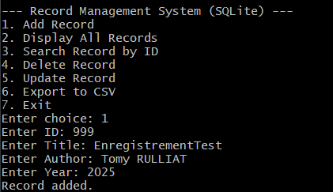
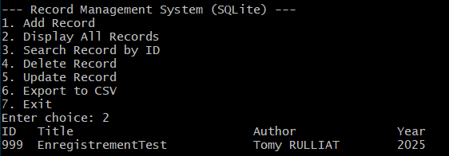
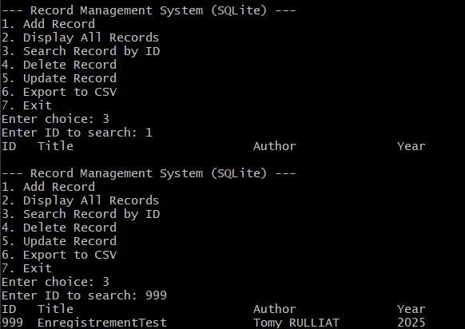
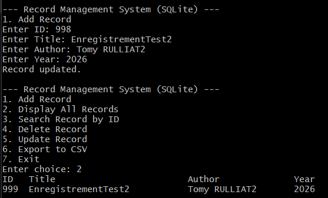
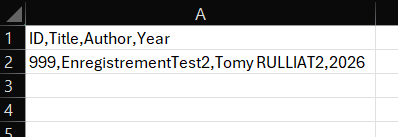
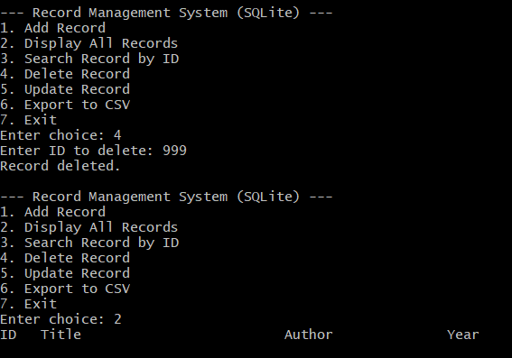

# Système de Gestion de Dossiers (Version SQLite)

Une application console simple en **C++** utilisant **SQLite3** comme base de données locale pour gérer des dossiers étudiants.

---

## 📥 Clonage du dépôt GitHub

Pour cloner le projet :

```bash
git clone https://github.com/votre-utilisateur/RecordManagementSystem.git
cd RecordManagementSystem
```
Assurez-vous que les fichiers suivants sont présents :
- RecordManagementSystemSQLite.cpp
- sqlite3.c
- sqlite3.h
- sqlite3ext.h

--- 

## ⚙️ Instructions de compilation
Vous avez besoin d’un compilateur C++ (comme MinGW) et des fichiers source de SQLite3.

✅ Étapes sur Windows (avec MinGW)
1. Installer MinGW

2. Vérifiez que g++ est dans le PATH avec ```g++ --version```

3. Compiler SQLite :

```bash
gcc -c sqlite3.c -o sqlite3.o
```
4. Compiler le programme principal :

```bash
g++ -std=c++17 RecordManagementSystemSQLite.cpp sqlite3.o -o rms.exe
```

5. Lancer le programme :
```bash
./rms.exe
```

---

## 🧪 Tests
Voici les fonctionnalités à tester :

1. Ajouter un enregistrement


2. Afficher tous les enregistrements


3. Rechercher un enregistrement par ID


4. Mettre à jour un enregistrement


5. Exporter les enregistrements

On obtient donc :


6. Supprimer un enregistrement


7. Quitter le système


---

## 🐛 Problèmes rencontrés

### Problèmes de compilation
1. g++ non reconnu dans le terminal
**Solution** : Ajouter g++ au PATH système via les variables d’environnement.

2. sqlite3.h introuvable
**Solution** : Utiliser #include "sqlite3.h" pour inclure le fichier local.

3. Erreurs de redéfinitions (redefinition)
**Solution** : Compiler d’abord sqlite3.c en sqlite3.o.

### Problèmes de développement (simulés)
1. Bug lors de l’entrée utilisateur : des caractères restaient dans le buffer.

2. Oubli initial de vérifier l’existence d’un ID en double avant insertion.

---

## 📊 Utiliser DBeaver avec SQLite

1. Télécharger DBeaver
2. Créer une connexion SQLite.
3. Ouvrir le fichier records.db généré automatiquement.
4. Naviguer dans la table STUDENTS.

---

## 💡 Auteur

Tomy Rulliat — Projet Erasmus C++ (2025)
